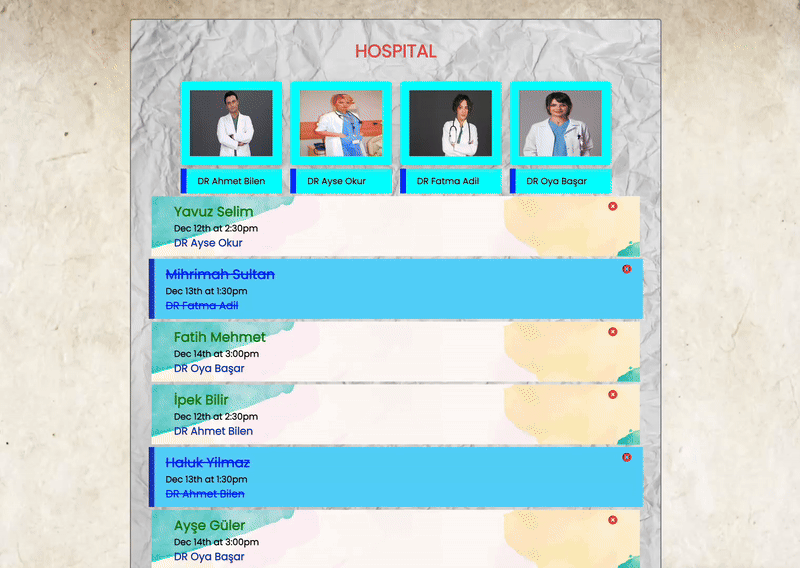

# Hospital Appointment Website

The website was designed to be used by doctors and secretaries and for those conditions.

## Project Overview

This project showcases:

- Deleting and adding a reservation by the chosen doctor.

## Features

- **Content Sections:**
  - **Home:** Displays the title of the website , the doctor cards and patients.
  - **AddPatient:** Displays a creating reservation form for the chosen doctor.
  - **PatientList:** Displays patients of the chosen doctor.

## File Structure
006 - Task Tracker (folder)

SOLUTION
├── public
├── src/
│ ├── components/
│ │ ├── AddPatient.jsx
│ │ └── PatientList.jsx
│ ├── helper/
│ │ └── Data.jsx
│ ├── pages/
│ │ └── Homes.jsx
│ ├── App.css
│ ├── App.jsx
│ └── main.jsx
└── index.html

## Preview

Here’s a preview of the project in action:

## Technologies Used

- **USESTATE**: For updating the dom.
- **REACT-ICONS**: For implementing icons.
- **REACT**: For structuring the content.
- **CSS**: For styling.
